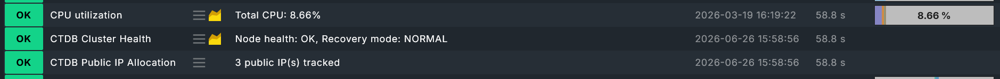

# Checkmk CTDB Cluster Monitoring Plugin

[](LICENSE)
[](https://checkmk.com/)
[](https://ctdb.samba.org/)
[](https://checkmk.com/)

A Checkmk agent plugin for monitoring CTDB cluster health and public IP allocation on clustered Samba/CTDB nodes.

This plugin runs `ctdb status` and `ctdb ip all` locally on each node and reports what it finds. Deploy it identically to every node in the cluster; both commands already return a cluster-wide view regardless of which node you ask, so running it everywhere gives redundant visibility.

## Features

- Per-node CTDB-reported health (PARTIALLYONLINE / DISABLED / STOPPED / UNHEALTHY / DISCONNECTED / BANNED) - distinct from whether the `ctdbd` process is merely running
- Cluster-wide recovery mode tracking, with a configurable grace period before a stuck RECOVERY is treated as an actual problem instead of a normal brief failover
- Public service IP allocation monitoring - catches an IP with no owning node and uneven distribution across the cluster
- Every severity independently configurable per state, no fixed opinions baked in
- Recovery duration tracked as a graphable metric, so you can see if recoveries are trending longer over time even when each one individually clears fine
- Deployed and configured via the Checkmk Agent Bakery

## Screenshots

### Example Services List


## How it works

The agent plugin runs on every node in the CTDB cluster. Each node reports on itself and on the cluster as a whole:

```
Each CTDB node
    -> CTDB Cluster Health        (this node's health + cluster recovery mode)
    -> CTDB Public IP Allocation  (cluster-wide public IP ownership)
```

Because `ctdb status` and `ctdb ip all` both return cluster-wide data no matter which node answers, every node ends up reporting the same recovery mode and the same IP map alongside its own node-specific health. That's intentional: if one node's agent goes dark, the others still carry the full picture.

## Requirements

- Checkmk 2.3.0p1+
- Linux host that is a node in a CTDB cluster, with the `ctdb` CLI installed and reachable via its local control socket
- The Checkmk agent runs as root by default, so no sudo configuration is needed in the common case. If you've explicitly opted into Checkmk's non-root agent deployment feature, see [Troubleshooting](#troubleshooting) below.

## Installation

### GUI

1. Go to **Setup -> Maintenance -> Extension packages**.
2. Upload the `.mkp` file.
3. Enable the package.
4. Activate changes.

### Command line

```
mkp add cmk-ctdb-<version>.mkp
mkp enable ctdb <version>
cmk -R
```

Validate the plugin after installation:

```
cmk-validate-plugins
```

## Setup

1. Create a rule under **Setup -> Agents -> Agent rules -> CTDB Cluster Monitoring**.
2. Assign the rule to every node in the CTDB cluster, or a host group covering all of them.
3. Bake and deploy the updated agent package.
4. Run service discovery on each node.

## Configuration

### Agent Bakery rule

Found under **Setup -> Agents -> Agent rules -> CTDB Cluster Monitoring**.

| Setting | Description | Default |
|---|---|---|
| `ctdb` command timeout | Seconds to wait for `ctdb status` / `ctdb ip all` before giving up and reporting an error | `15` |

### Service monitoring rules

**CTDB Cluster Health** - found under **Setup -> Service monitoring rules -> Applications -> CTDB Cluster Health**.

| Setting | Description | Default |
|---|---|---|
| State for PARTIALLYONLINE | Some interfaces down, node still serving | WARN |
| State for DISABLED | Administratively pulled from rotation | WARN |
| State for STOPPED | Administratively removed from cluster | WARN |
| State for UNHEALTHY | A monitored service is actually broken | CRIT |
| State for DISCONNECTED | Unreachable, IP already failed over | CRIT |
| State for BANNED | Booted for repeated recovery failures | CRIT |
| Grace period before RECOVERY is "stuck" | Seconds a brief failover blip is tolerated before escalating | `30` |
| State once grace period exceeded | Severity once RECOVERY has outlasted the grace period | CRIT |

**CTDB Public IP Allocation** - found under **Setup -> Service monitoring rules -> Applications -> CTDB Public IP Allocation**.

| Setting | Description | Default |
|---|---|---|
| State when an IP has no owning node | A public service IP that nobody is currently hosting | CRIT |
| Max public IPs on a single node before flagging | Threshold for "too many IPs piled on one node" | `2` |
| State when concentration exceeds the threshold | Severity for uneven IP distribution | WARN |

## Discovered services

| Service | Description |
|---|---|
| `CTDB Cluster Health` | This node's CTDB-reported health, plus cluster-wide recovery mode |
| `CTDB Public IP Allocation` | Cluster-wide public IP ownership and distribution |

Example service output:

```
CTDB Cluster Health         OK      Node health: OK, Recovery mode: NORMAL
CTDB Public IP Allocation   OK      3 public IP(s) tracked
```

## Metrics

`ctdb_recovery_elapsed` tracks how long the cluster has been in RECOVERY mode, in seconds. It's `0` while NORMAL and climbs for the duration of any recovery, dropping back to `0` once it clears. Mostly useful for noticing whether recoveries are trending longer over time, not something you'd watch live.

## Check parameters

Check parameter rules are found under **Setup -> Service monitoring rules -> Applications -> CTDB Cluster Health** and **CTDB Public IP Allocation**. Every severity listed above is independently overridable; nothing is hardcoded.

## Troubleshooting

### Run the plugin manually on a CTDB node

```bash
/usr/lib/check_mk_agent/plugins/ctdb_status.py
```

The plugin writes the `<<<ctdb_node_status>>>` and `<<<ctdb_ip_allocation>>>` sections to stdout as JSON. If `ctdb` itself is the problem, you'll see an `"error"` key in the relevant section instead of a crash.

You can also run the raw commands directly to rule out the plugin itself:

```bash
ctdb status
ctdb ip all
```

### Possible Issues

**`ctdb command not found` or permission errors**

The Checkmk agent runs as root by default, so this is unusual unless you've explicitly configured Checkmk's non-root agent deployment feature. If you have, the agent user will need a sudoers entry granting passwordless `ctdb status` and `ctdb ip all`.

**CTDB Public IP Allocation flags imbalance on a cluster that's deliberately uneven**

If your cluster intentionally restricts certain public IPs to a subset of nodes (different `public_addresses` files per node), this plugin won't know that's intentional - it just counts how many IPs ended up per node across the whole cluster. Raise the "max public IPs on a single node" threshold for that cluster, or set the imbalance state to OK if it's not a useful signal for your topology.

**Recovery mode flips to WARN more often than expected**

A few seconds in RECOVERY during a normal failover is expected and is by design not flagged as a problem until the grace period passes. If your hardware or network genuinely needs longer than the default 30s to complete a recovery, raise the grace period rather than treating every recovery as urgent.

## Known limitations

- Linux only - CTDB itself doesn't run anywhere else anyways!
- Tested against CTDB on Ubuntu and Checkmk 2.5.x.
- IP allocation imbalance is a simple per-cluster count of IPs per node; it has no concept of intentionally-restricted public IP groups (see Troubleshooting above).

## License

This project is licensed under the GNU General Public License v2.0 only. See [LICENSE](LICENSE).

This project is an independent Checkmk extension and is not affiliated with or endorsed by Checkmk GmbH or the CTDB/Samba projects.